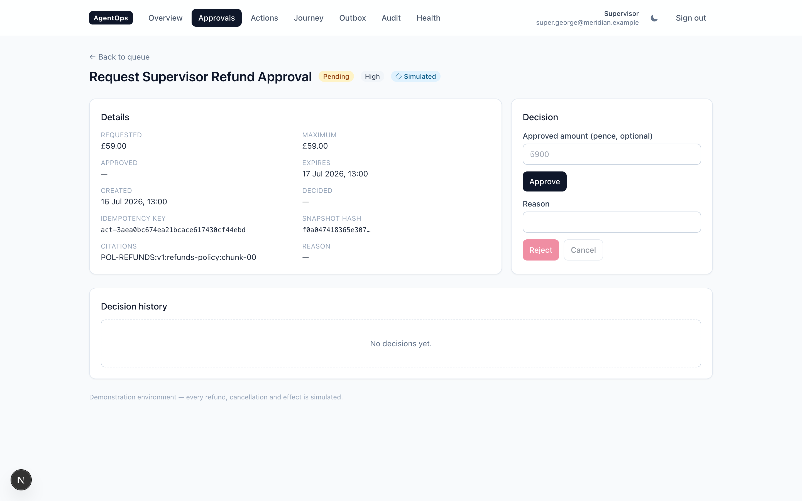
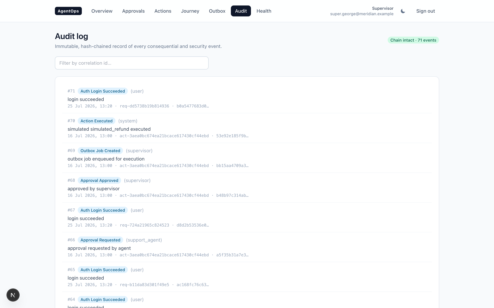

<div align="center">

# Ephor

[](https://github.com/Nabzx/ephor/actions/workflows/ci.yml)
&nbsp;
&nbsp;
&nbsp;

The safety layer for AI agents that take real action.<br>
An agent proposes, a human approves, the action runs exactly once, and every step is proven — not just logged.

</div>

| Approval detail + decision | Hash-chained audit log |
| --- | --- |
|  |  |

## Why

Letting an AI agent act on its own is fast until it's wrong — a refund it shouldn't have issued, a
charge it retried twice, a change nobody can explain afterwards. Ephor puts a checkpoint in front
of every consequential action: nothing happens until a human sees exactly what's about to occur
and says yes.

Named after the Spartan magistrates whose job was to check the king's power before it acted —
2,500 years before this project's `propose → approve → execute` loop existed for the same reason.

## How it works

- **Propose** — an agent puts forward one concrete action. It never executes on its own.
- **Approve** — a human sees a frozen, hashed snapshot of exactly what will happen, and decides.
- **Execute** — once approved, the action runs through a durable outbox, **exactly once** — proven
  by a crash-recovery test, not just claimed.
- **Audit** — every step writes to an append-only, hash-chained log. Tampering breaks the chain
  detectably; nothing can be quietly edited or deleted.

## Quickstart

```bash
git clone https://github.com/Nabzx/ephor.git
cd ephor
make up && make seed      # stack + synthetic data
make demo                 # approval -> execution, exactly once, in your terminal
```

Then open the dashboard at <http://localhost:3000>. Everything is deterministic, offline and
simulated — no paid API, no external network, nothing real is ever contacted.

## Status

Early. The audit layer is extracted, tested, and reusable as its own package
(`ephor/`, [ADR-0007](docs/adr/0007-audit-store-interface.md)); the approval gate and durable
outbox are being extracted next. The reference app in this repo — an AI support-ops platform —
already runs the full loop end to end today; Ephor's job is making that loop reusable for any
agent, starting with a Stripe revenue-recovery detector next.

## Contributing

Issues are tracked with a locked-spec workflow — see [AGENTS.md](AGENTS.md) for how a decision
gets settled before anyone builds it, and [CONTRIBUTING.md](CONTRIBUTING.md) for the loop itself.

There's no company behind this, just one person building in public. If it's useful, or the idea
resonates, a star is the biggest help there is — it's how someone else finds it.

## Licence

[Apache-2.0](LICENSE)
