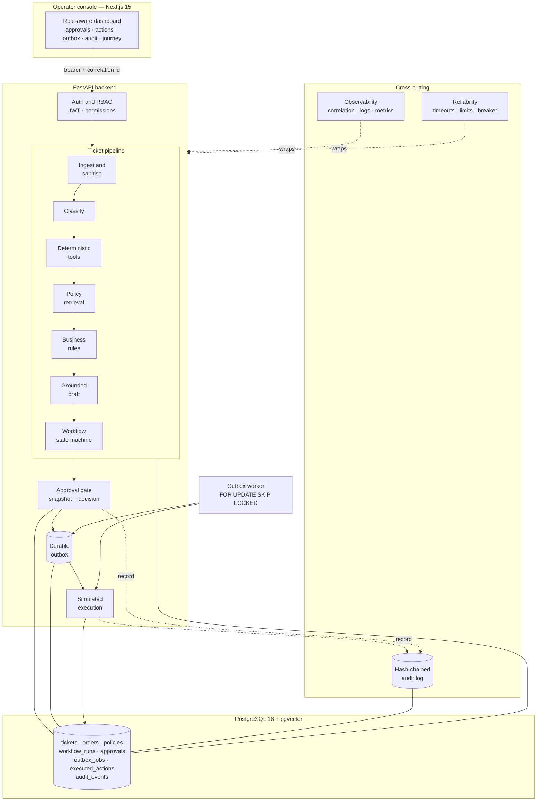
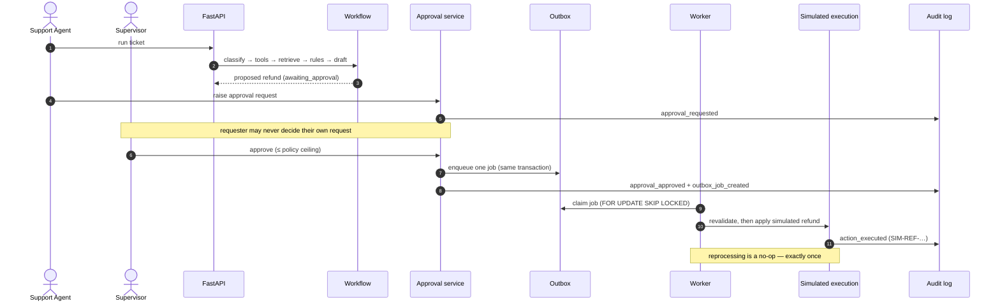

# Architecture

How AgentOps fits together, end to end. This is the map; the per-component notes linked
in the [documentation index](#documentation-index) are the territory.

AgentOps is an **internal support-operations platform** — not a customer-facing chatbot.
A support ticket flows through an explicit, auditable pipeline that classifies it, resolves
the customer and order, retrieves the governing policy, applies **deterministic business
rules**, drafts a grounded reply, and — for any consequential action — stops at a **human
approval gate** before a durable worker executes it **exactly once**. Every effect is
**simulated**; nothing external is ever contacted.

## System overview

The **model layer is provider-neutral** and defaults to a deterministic **mock** — the whole
system runs offline, with no paid API, no Ollama and no external network, in development,
tests and CI alike. Optional Ollama and hosted OpenAI-compatible adapters exist but are never
required.

## The canonical journey

A refund is the archetype: an agent proposes it, a supervisor approves it, and a durable
worker applies the simulated effect exactly once — every step threaded by one correlation id
and written to the tamper-evident audit log.

## Load-bearing design decisions

1. **Human-in-the-loop approvals.** No refund or cancellation executes without a named
   supervisor decision on a **hashed snapshot** of exactly what they were shown. Self-approval
   is refused independently of role; concurrent decisions are resolved by a single row-locked
   winner. → [approval-system.md](approval-system.md), [authentication-rbac.md](authentication-rbac.md)

2. **Durable transactional outbox.** A granted approval enqueues its execution job in the
   **same database transaction** as the decision, so an approval and its job can never diverge.
   A dedicated worker claims jobs with `FOR UPDATE SKIP LOCKED`, leases them, and records an
   immutable attempt history with bounded jittered retries and dead-lettering. → [outbox-worker.md](outbox-worker.md)

3. **Exactly-once effects.** Each effect is keyed by an idempotency key and guarded by a
   final revalidation; reprocessing the same job produces no second refund. The guarantee is
   proven by an evaluation gate, not just asserted. → [exactly-once-semantics.md](exactly-once-semantics.md), [action-execution.md](action-execution.md)

4. **Tamper-evident audit.** Every consequential and security event is written — in the same
   transaction as the event — as a hash-chained row (`entry_hash = H(previous_hash ‖ payload)`).
   Any edit or deletion breaks the chain, which `make audit-verify` detects. → [audit-log.md](audit-log.md)

5. **Deterministic and offline by construction.** A mock model provider, a seed reference
   clock (2026-07-16), deterministic embeddings and fully synthetic data mean every run —
   including CI — is reproducible with no network. Language quality is out of scope by design;
   the system exercises the *engine* around the model. → [model-providers.md](model-providers.md), [synthetic-data.md](synthetic-data.md)

## Trust boundary

The AI proposes; the deterministic layer decides. Model output is always a **proposal**
validated against strict schemas and safety rules (tool allowlist, citations ⊆ supplied,
action ∈ allowed list, no false execution claim). Ownership, eligibility, limits, risk and
routing are settled by deterministic rules — never by model text — and nothing consequential
runs without passing the approval gate. Adversarial ticket content (e.g. prompt injection) is
stored verbatim for evaluation and can never become authoritative evidence or an executed
action. → [threat-model.md](threat-model.md), [security-hardening.md](security-hardening.md)

## Documentation index

| Layer / concern | Stage | Docs |
| --- | --- | --- |
| Domain & synthetic data | S1 | [domain-model.md](domain-model.md), [synthetic-data.md](synthetic-data.md) |
| Deterministic tools & rules | S2 | [tool-system.md](tool-system.md), [business-rules.md](business-rules.md) |
| Policy retrieval & grounding | S3 | [policy-indexing.md](policy-indexing.md), [policy-retrieval.md](policy-retrieval.md), [retrieval-evaluation.md](retrieval-evaluation.md) |
| Model layer & prompts | S4 | [model-providers.md](model-providers.md), [prompt-system.md](prompt-system.md), [model-tasks.md](model-tasks.md), [model-evaluation.md](model-evaluation.md) |
| Workflow engine | S5 | [workflow-state-machine.md](workflow-state-machine.md), [workflow-engine.md](workflow-engine.md), [workflow-recovery.md](workflow-recovery.md), [workflow-replay.md](workflow-replay.md), [workflow-evaluation.md](workflow-evaluation.md) |
| Approvals & durable execution | S6 | [approval-system.md](approval-system.md), [authentication-rbac.md](authentication-rbac.md), [outbox-worker.md](outbox-worker.md), [action-execution.md](action-execution.md), [exactly-once-semantics.md](exactly-once-semantics.md), [approval-action-evaluation.md](approval-action-evaluation.md) |
| Observability, audit & reliability | S7 | [observability.md](observability.md), [audit-log.md](audit-log.md), [production-reliability.md](production-reliability.md) |
| End-to-end eval & security | S8 | [end-to-end-evaluation.md](end-to-end-evaluation.md), [security-hardening.md](security-hardening.md), [threat-model.md](threat-model.md) |
| Frontend dashboard | S9 | [frontend-dashboard.md](frontend-dashboard.md) |
| Demo & portfolio | S10 | [demo-runbook.md](demo-runbook.md), [portfolio.md](portfolio.md) |

See the [demo runbook](demo-runbook.md) to drive the whole thing in about ten minutes.
