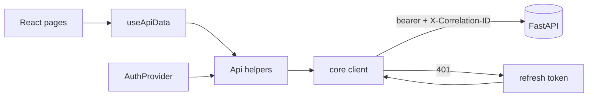

# Frontend dashboard

A role-aware operator console for AgentOps, built on the existing S6–S8 APIs. Support
Agents and Supervisors sign in, work the approval queue, decide approvals, and inspect
actions, the outbox, the audit trail, ticket journeys and system health. Every consequential
figure is labelled **simulated** — the UI only ever renders the PII-safe data the API sends.

| Approval detail + decision | Audit log (chain intact) |
| --- | --- |
|  |  |

More screens in [`docs/screenshots/`](screenshots/).

## Stack

Next.js 15 (App Router) · React 19 · TypeScript · Tailwind CSS 3 · Vitest. No component
library, data-fetching library or state manager — a small typed client, an auth context and
a `useApiData` hook keep the surface minimal and deterministic. Light/dark theming via a
class toggle.

## Data flow



- **`lib/client.ts`** — attaches the bearer token, sends a per-action `X-Correlation-ID`,
  normalises the backend `{code, message, request_id}` envelope into `ApiError`, and
  refreshes the access token once on a 401 before retrying.
- **`lib/session.ts`** — access token in memory; refresh token in `sessionStorage` (never
  `localStorage`). Tokens are never rendered.
- **`lib/auth.tsx`** — session, current user (`/api/auth/me`) and the authenticated `Api`.
- **`lib/roles.ts`** — permission-gated navigation; the UI hides what a role cannot use, and
  still fails safe if the API returns 403.

## Screens

| Route | Purpose | APIs |
| --- | --- | --- |
| `/login` | Sign in | `POST /api/auth/login`, `GET /api/auth/me` |
| `/dashboard` | Overview: pending approvals, outbox stats | `/api/approvals`, `/api/outbox/stats` |
| `/dashboard/approvals` | Queue (filter by status, mine; expiring first) | `GET /api/approvals` |
| `/dashboard/approvals/[id]` | Detail, decisions, approve/reject/cancel/retry | `/api/approvals/{id}`, `/decisions`, `/approve|reject|cancel|retry` |
| `/dashboard/actions` | Executed simulated actions | `GET /api/actions` |
| `/dashboard/outbox` | Job queue + attempt history (Supervisor) | `/api/outbox`, `/api/outbox/{id}/attempts` |
| `/dashboard/audit` | Hash-chained audit log + chain verify (Supervisor) | `/api/audit`, `/api/audit/verify` |
| `/dashboard/journey` | One correlation id across approval → execution → audit | `/api/audit/correlation/{id}` |
| `/dashboard/health` | Liveness/readiness, outbox stats, metrics, demo | `/health`, `/health/ready`, `/api/outbox/stats`, `/metrics`, dev `process-one` |

## Role-based access

Navigation and actions come from the user's permissions (`/api/auth/me`). Agents see the
queue, actions and journey; Supervisors additionally see the outbox and audit and can decide
approvals. Decision buttons are gated by `approval_decide` and by the self-approval rule (a
requester can never decide their own request). Hidden controls are also enforced server-side.

## Approval UX

The detail screen shows the PII-safe summary, amounts, evidence/snapshot hash and citations,
plus the append-only decision history. A Supervisor can approve (optionally reducing the
amount), reject or cancel (reason required), or authorise a retry of a technically-failed
execution. Each outcome shows the resulting workflow state and whether an outbox job was
queued, via a toast — all labelled simulated.

## Demo

On the Health screen, a Supervisor can "Run one job" — the environment-gated dev endpoint
runs one worker tick so a reviewer can approve → process → watch a simulated refund appear in
Actions and the Audit trail. Disabled outside development/test.

## Accessibility & theming

Keyboard-operable controls with visible focus rings, ARIA roles/labels (`status`, `alert`,
`aria-live` toasts, `aria-current` nav), sufficient contrast in both themes, and a responsive
layout from mobile to desktop. Theme follows the OS by default and persists the user's choice.

## PII safety

The response schemas are PII-safe by construction (identifiers, statuses, amounts and hashes
only); a frontend test asserts the consumed types declare no PII/secret fields, mirroring the
backend leak-scan. The UI never displays passwords, tokens or customer contact details.

## Running

```bash
docker compose up --build -d          # db, backend, worker, frontend
# frontend at http://localhost:3000, backend at http://localhost:8000
cd frontend && npm run lint && npm run typecheck && npm test && npm run build
```

Sign in with a seeded user (see `make list-users`) and the development password.
