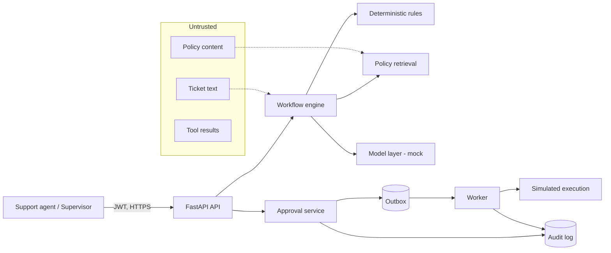

# Threat model

A STRIDE-style threat model for AgentOps. The system is an internal support-ops platform
on fully synthetic data with **simulated** effects, so the highest-value assets are the
integrity of consequential decisions and the confidentiality of (synthetic) customer data.

## Assets & trust boundaries

Trust boundaries: the network edge (API), the human decision (approval), and the
deterministic authority (rules) — **untrusted content never crosses into an executed
action without a human decision and deterministic revalidation**.

| Asset | Why it matters |
| --- | --- |
| Approval decisions | authorise (simulated) money movement |
| Executed-action & refund ledger | exactly-once financial record |
| Audit log | tamper-evident record of every consequential event |
| Customer PII (synthetic) | confidentiality / cross-customer isolation |
| JWT secret & config | authentication integrity |

## Threats → mitigations

| STRIDE | Threat | Mitigation | Evidence |
| --- | --- | --- | --- |
| **S**poofing | Forged identity / token | JWT with type checking, bcrypt, per-request auth | `app/auth`, permission-matrix test |
| **T**ampering | Altered payload/snapshot before execution | SHA-256 payload + snapshot hashes re-verified at execution | S6 revalidation, E2E `unsafe_execution` gate |
| **T**ampering | Altered/deleted audit record | Hash-chained append-only log with chain verification | `app/audit`, `unaudited_action`/chain tests |
| **R**epudiation | "I didn't approve that" | Immutable, actor-attributed audit + decision rows | audit log, decisions table |
| **I**nfo disclosure | Cross-customer data / PII leak | Ownership rules, PII-safe schemas, log/audit redaction | `cross_customer_exposure` + `pii_leak` gates |
| **I**nfo disclosure | Secrets in logs | Redaction filter (PII + tokens/JWT/cards) | leak-scan test |
| **D**enial of service | Oversized / flooding requests | Size limit, per-client rate limit, timeouts | reliability middleware tests |
| **D**enial of service | Provider hang / failure | Circuit breaker + fallback to deterministic mock | breaker tests |
| **E**levation | Prompt-injection driving an action | Instruction hierarchy: rules > human > model > content | injection gate, workflow escalation |
| **E**levation | Agent acting beyond role / IDOR | Permission checks on every endpoint, ownership scoping | permission-matrix + IDOR tests |
| **E**levation | Unsafe production config | Startup guard (no dev secret/debug/wildcard CORS) | config-hardening test |

## Residual risks

- Effects are **simulated**; a real deployment would add real payment/carrier integration
  and its own threat surface (out of scope until productionised).
- The default model provider is a deterministic mock; a real LLM adds prompt-injection
  surface that the instruction hierarchy is designed to contain but which needs ongoing
  red-teaming.
- Rate limiting and the circuit breaker are in-process (single instance); a multi-instance
  deployment would need shared state (deferred; no Redis by design).
- Dependency advisory scanning is offline (lockfile consistency only); a connected CI
  would add a networked vulnerability scan.

See [security-hardening.md](security-hardening.md) for the enforced checklist and
[end-to-end-evaluation.md](end-to-end-evaluation.md) for the graded gates.
