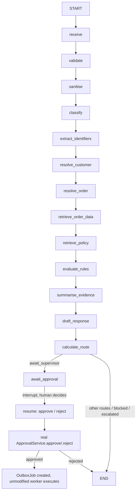

# LangGraph pipeline demo (S11, portfolio)

A second implementation of the S5 support-ticket pipeline, built on
[LangGraph](https://github.com/langchain-ai/langgraph)'s `StateGraph`, living entirely
alongside the production engine. **This is a demonstration, not a migration.**
`WorkflowRunner`, the FastAPI routes and every existing test are untouched — nothing
here is on the request path.

> The point isn't "LangGraph is better." It's proving the gateway idea works: the same
> handlers, the same transition table, the same approval and outbox subsystems, driven
> by a different orchestrator. If the orchestration layer were ever swapped for real,
> this is what would have to be true first.

## Why it doesn't reimplement anything

The S5 handlers already have the exact shape a LangGraph node needs — one pure async
function per step, `(ctx, state) -> StepExecutionResult`. So every node in
[`app/workflows/graph/nodes.py`](../backend/app/workflows/graph/nodes.py) is a thin
wrapper: build a `WorkflowExecutionContext`, call the unmodified handler from
`app.workflows.handlers`, persist the step + checkpoint through the same
`WorkflowRepository` the runner uses, and let the returned `destination_state` pick the
next edge. The transition table in `app/workflows/definition.py` is read, never
duplicated.

The approval pause is where LangGraph earns its keep: `interrupt()` is a real
pause-and-resume primitive, not a hand-rolled one. `app/workflows/graph/approval.py`
calls `interrupt()` with the proposed action, and on resume calls the **real**
`ApprovalService.create_request` / `.approve` / `.reject` — inheriting snapshot hashing,
idempotency and the exactly-once outbox job creation completely unmodified. The graph
never executes anything itself; approval hands off to the same `OutboxJob` row the
production outbox worker picks up.

## Graph



Any of the 13 step nodes can also route straight to `END` (escalated, blocked,
needs-information, failed-*) — the diagram above shows the common path, not every edge;
the real edges are exactly `app.workflows.definition.TRANSITIONS`.

## Running it

```bash
cd backend && python -m app.seeds.cli seed   # once, if not already seeded
python -m app.workflows.graph.demo DEMO-REFUND-APPROVAL-001
```

Prints the proposed action when the graph pauses, prompts `approve? [y/N]`, resumes, and
confirms the `OutboxJob` row that was created. `--approve` / `--reject` skip the prompt.
A ticket that never reaches `await_approval` (most demo tickets) just prints its final
state.

```bash
pytest backend/tests/test_workflow_graph.py -v
```

Three parity tests against the same seeded demo tickets `test_workflow_integration.py`
uses: a plain auto-resolve (`DEMO-TRACKING-001` → `awaiting_agent`), an early block with
no approval reached (`DEMO-CROSS-CUSTOMER-001` → `blocked`), and the interrupt path
(`DEMO-REFUND-APPROVAL-001` → interrupt → resume approved → exactly one `OutboxJob`).

## What's identical to production

Every handler decision, the transition table, rule evaluation, policy retrieval,
drafting, and `ApprovalService`'s snapshot hashing, idempotency key and exactly-once
outbox enqueue. Runs are tagged with a distinct `workflow_name`
(`support-ticket-v2-langgraph-demo`) so a graph-demo run can never collide with a real
`support-ticket-v2` run on the ticket's active-run uniqueness constraint — the workflow
`version` stays `2.0.0`, since `ApprovalService` requires it.

## What's different, honestly

- **Per-node DB bookkeeping is duplicated from `runner.py`.** `WorkflowRunner._run_one_step`
  is a `while`-loop over the transition table; LangGraph drives one node per call, so
  `nodes.py` re-does the `start_step` → handler → `complete_step` → `append_checkpoint` →
  `update_state`/`mark_terminal` → commit sequence by hand. Every actual *decision* still
  comes from the unmodified `handlers.py`/`definition.py` — this is orchestration
  plumbing, not business logic — but it's real duplication, not "zero," and it's the
  cost of keeping `runner.py` untouched.
- **Two independent checkpoint systems run in parallel.** The Postgres
  `workflow_checkpoints` table is written exactly as production does; LangGraph's own
  `MemorySaver` also checkpoints the graph state (needed for `interrupt()`/resume) in a
  separate, in-process, non-durable store. `SupportWorkflowState` was designed for JSON
  snapshot storage, not LangGraph's msgpack serde, so its checkpointer logs non-fatal
  "unregistered type" warnings for a couple of enum/driver-native values — round-trip
  correctness (interrupt → resume → correct final state) was verified end to end despite
  the warning; it doesn't affect behaviour.
- **No claim/lease story.** `WorkflowRepository.claim`/`FOR UPDATE SKIP LOCKED` is never
  called — a graph run is single-process by construction, so there's no competing worker
  to lock out.
- **Execution stops at the approval decision.** The graph doesn't continue into
  `EXECUTING_ACTION`; it hands off to the real `OutboxJob` row and the unmodified outbox
  worker does the rest, exactly as production does after `ApprovalService.approve`.

## What a real cutover would need

A persistent checkpointer (`AsyncPostgresSaver` instead of `MemorySaver`) so `interrupt()`
survives a process restart; a claim/lease equivalent — or accepting LangGraph's own
concurrency model — for multi-worker safety; and either living with the per-node
bookkeeping duplication permanently, or refactoring `runner.py`'s loop into an injectable
per-step primitive both orchestrators could share. None of that is done here — the point
of this package is the gateway, not the migration.

`langgraph` pulls in `langchain-core`, `langgraph-sdk` and `langsmith` transitively.
`langsmith` is a tracing client; it's inert here unless `LANGCHAIN_TRACING_V2` is set,
which it isn't.
